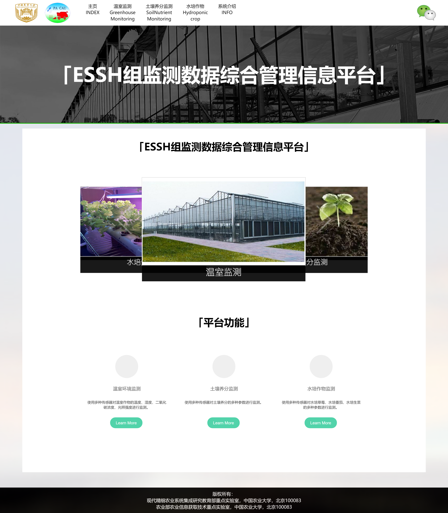
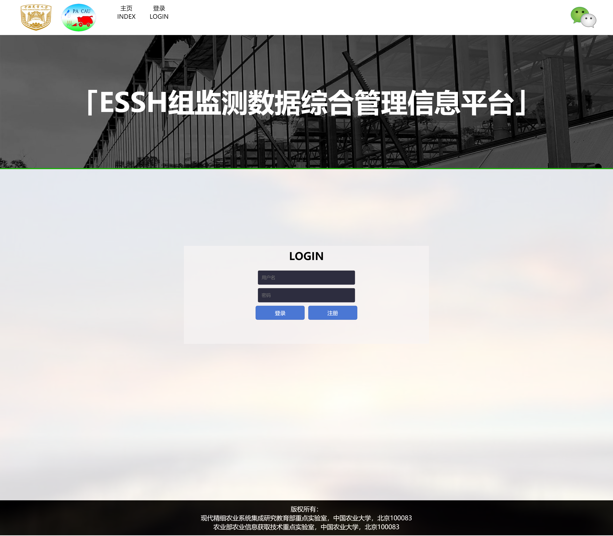
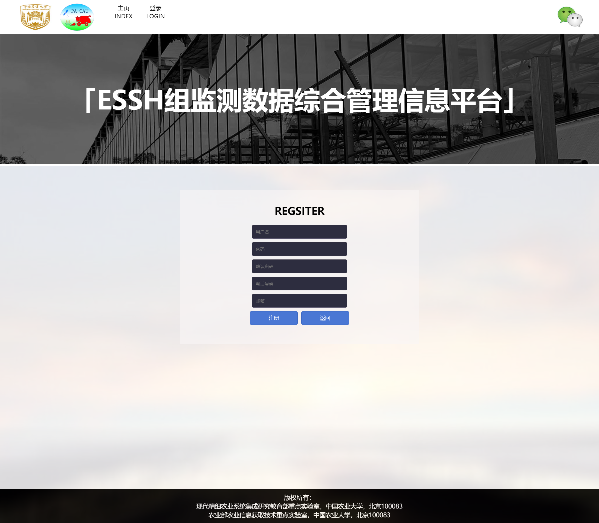
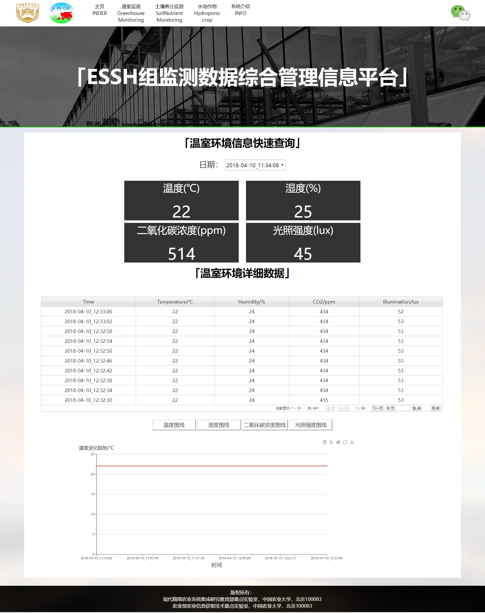

# 水培生菜监测系统
网址：[www.causpsc.com](http://www.causpsc.com)

# 系统介绍
本科毕业设计，一个基于安卓终端的温室环境监测系统设计与开发,系统由底层硬件模块，安卓智能终端模块，云计算平台模块。具体系统设计图如下：

# 模块总体介绍
云计算平台模块是整个系统的最后一环，主要承担数据在网页平台和微信公众号展示的任务，主要包括底层部分和上层部分。底层部分以云服务器为基础，用于存储从安卓智能终端平台上传的水培生菜环境参数数据，以及网页平台和微信公众平台的代码。上层部分包含网页平台和微信公众号，可与使用者进行交互，查询水培生菜环境参数数据。通过两个部分的互相协作，云计算平台模块可满足数据在网络展示的需求，
目前，网页依然是大部分人获取信息的首要途径，以网页平台展示数据的方式符合目前科技发展趋势和大部分用户使用习惯。因此，在云计算平台模块中设计了一个网页平台，可实现快速查询、表格绘制以及图线绘制等功能。用户可对水培生菜环境参数的单个数据、整体数据以及数据的变化趋势进行直观的分析。网页的设计与实现将在本章详细阐述。
此外，微信公众号也是一种信息传递与共享的主要方式，随着微信的热门发展，设计一个微信公众号用于对水培生菜环境参数数据的查询也具有重大意义。因此，本研究申请了一个微信公众号，通过开发者模式开发后，用户只需要微信公众号上输入相关指令，便可快速查询到最新的水培生菜环境参数数据，对比网页平台，微信公众号虽无法查到详细数据以及变化趋势但查询方式更简单便捷。网页结构如下图所示：

网页首页如下图所示：

# 用户系统
用户系统用于保护水培环境信息数据保护，主要包括登录和注册两个部分。“登录”指的是用户通过自身的账号和密码去获得使用系统的权限，以方便系统对用户进行识别，“注册”则是用户在网站上新建账号和密码的过程。登录界面如下图所示：

云计算平台模块的网页平台的登陆部分是先通过读取网页上的用户名和密码输入栏数值，再通过PHP脚本文件，对比云服务器中的用户数据。比对过程如下：（1）通过用户名的字段找到数据库中相应的存储字段；（2）读出用户名对应的密码字段与密码输入栏输入的值比对，对比结果一致则可成功登录，不一致则提示“用户名或密码错误”。
注册部分的实现过程主要分为以下几个步骤：（1）将输入值记录在多个与数据库栏位变量名对应的变量中；（2）通过PHP脚本文件将值插入到云服务器中的用户数据库内，即把资料存储到数据库。注册界面如下图所示：

# 数据显示模块
数据显示模块分为三个模块：快速查询模块、表格绘制模块、图线绘制模块。快速查询模块用于快速获得特定时间的水培生菜环境参数数据；表格绘制模块用于宏观展示整个水培生菜环境参数数据库；图线绘制模块用于绘制数据相应的图线，展示水培生菜环境参数数据的变化趋势。以下将对这个三个部分的实现作出阐述。查询界面如下图所示：

## 快速查询
快速查询即通过选取相应的日期，查看对应日期下的水培生菜环境参数数据。主要通过PHP语言和Ajax技术来实现。Ajax是一种用于塑造强交互性的Web应用程序，具有向服务器提出数据请求并处理响应但不对用户产生阻塞的优点。因此，在不对页面进行重载的情况下即可与云服务器后台交换数据，即不需刷新页面就可产生对页面局部刷新的效果。
快速查询功能的实现过程主要分为以下几个步骤：，（1）通过PHP编写相关脚本文件连接到云服务器后台的MySQL数据库，调取日期数据用于填充选择框；（2）用户通过选择框选取日期后，使用JavaScript的onchange（）函数记录日期（3）通过PHP编写的相关脚本文件再次连接数据库，将数据库内的数据再次全部读出进行遍历，直至找到相应的字段。（4）通过Ajax技术将页面刷新，显示出该字段对应的水培生菜环境参数数据。通过两次对数据库的连接最终实现对数据的快速查询功能。

## 表格绘制
表格绘制功能即将数据库内的水培生菜环境参数数据通过表格进行宏观展示，主要通过PHP语言和bsgrid表格绘制插件来实现。Bsgrid表格绘制插件支持json、xml等多种数据格式，可支持表格的编辑、本地数据、导出参数构建等功能，具有易扩展性，拥有大量的表格示例，以及问题反馈的及时响应式的表格绘制插件。
表格绘制功能的实现主要分为以下几个步骤：（1）通过PHP连接云服务器，并以json形式导出数据库内的所有水培生菜环境参数数据；（2）在网页页面上建立相应区域；（3）调用bsgrid的表格绘制函数$.fn.bsgrid.init生成表格，$.fn.bsgrid.init工作时会将之前导出的json格式进行导入，最终完成表格的绘制。

## 图线绘制
图线绘制功能即将数据库内的水培生菜环境参数数据的变化趋势以图线形式进行展示，主要通过Ajax技术、PHP语言和ECharts图线绘制插件来实现。ECharts 是指 Enterprise Charts，中文名为商业产品图表库，其底层结构基于 ZRender，并附带了坐标系，图例，工具箱等组件，可在此上构建出多种图表的图线绘制插件。
图线绘制功能的实现和快速查询和表格绘制的实现类似，首先通过PHP编写脚本文件连接后台数据库，读出后台数据库的水培生菜环境参数全部数据，再通过Ajax技术将数据以数组形式分开搭载。最后调用ECharts的图线绘制函数，对导出数据数组进行导入，完成图线的绘制。图线绘制模块如图4-12、4-13、4-14、4-15所示。

