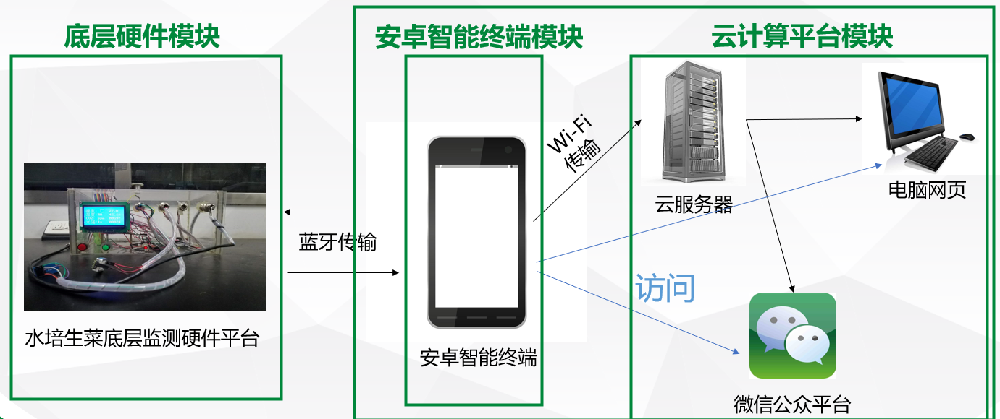
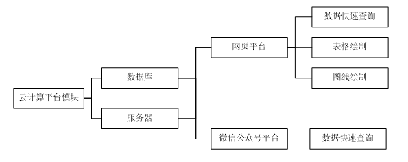

# SPSC
本科毕业设计，一个基于安卓终端的温室环境监测系统设计与开发,系统由底层硬件模块，安卓智能终端模块，云计算平台模块。具体系统设计图如下：

云计算平台模块是整个系统的最后一环，主要承担数据在网页平台和微信公众号展示的任务，主要包括底层部分和上层部分。底层部分以云服务器为基础，用于存储从安卓智能终端平台上传的水培生菜环境参数数据，以及网页平台和微信公众平台的代码。上层部分包含网页平台和微信公众号，可与使用者进行交互，查询水培生菜环境参数数据。通过两个部分的互相协作，云计算平台模块可满足数据在网络展示的需求，
目前，网页依然是大部分人获取信息的首要途径，以网页平台展示数据的方式符合目前科技发展趋势和大部分用户使用习惯。因此，在云计算平台模块中设计了一个网页平台，可实现快速查询、表格绘制以及图线绘制等功能。用户可对水培生菜环境参数的单个数据、整体数据以及数据的变化趋势进行直观的分析。网页的设计与实现将在本章详细阐述。
此外，微信公众号也是一种信息传递与共享的主要方式，随着微信的热门发展，设计一个微信公众号用于对水培生菜环境参数数据的查询也具有重大意义。因此，本研究申请了一个微信公众号，通过开发者模式开发后，用户只需要微信公众号上输入相关指令，便可快速查询到最新的水培生菜环境参数数据，对比网页平台，微信公众号虽无法查到详细数据以及变化趋势但查询方式更简单便捷。网页结构如下图所示：

